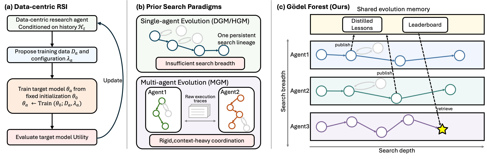

<h1 align="center">Gödel Forest</h1>

<p align="center">
  <strong>Gödel Forest: Balancing Search Depth and Breadth for Data-Centric Recursive Self-Improvement</strong>
</p>

<div align="center">

[![Evolvent AI][evolvent-image]][evolvent-url]
[![X][x-image]][x-url]
[![LinkedIn][linkedin-image]][linkedin-url]


</div>

Gödel Forest is a data-centric recursive self-improvement agent for
[RSIBench-Data](https://github.com/evolvent-ai/RSIBench-Data). It plugs into
the benchmark through RSIBench-Data's `DATA_AGENT_COMMAND` hook, runs inside
RSIBench-Data's Docker session, and drives the `claude` CLI until a final
submission is made or the time / cost budget is exhausted.

## System Overview

<p align="center">
  
</p>

### Core Properties

- **Single- or multi-agent**: run one agent, or several isolated workers under
  a shared manager that submits the best full-evaluation attempt.
- **Evidence-driven workflow**: installs research, planning, and attempt-review
  skills into the agent workspace.
- **No changes to RSIBench-Data**: installs as a package into RSIBench-Data's
  `.venv` and is selected at launch time.

## Quick Start

This repo does not run on its own; it needs an RSIBench-Data checkout.

### 1. Prepare RSIBench-Data

Clone RSIBench-Data and follow its README to set up the `.venv`, the Docker
runtime image, and `.env` (credentials, model, and budget).

### 2. Point Gödel Forest at RSIBench-Data

```bash
export RSIBENCH_DATA_REPO_ROOT=/path/to/RSIBench-Data   # default: /data/RSIBench-Data
```

If RSIBench-Data's `.env` sets `DATA_AGENT_COMMAND`, it must be
`$RSIBENCH_DATA_REPO_ROOT/.venv/bin/python -m godel_forest`; otherwise remove
that line.

### 3. Install (Optional)

Every launch installs this package into RSIBench-Data's `.venv` automatically.
To install without starting a run:

```bash
bash tools/install_into_rsibench_data.sh "$RSIBENCH_DATA_REPO_ROOT"
```

## Run an Experiment

Run all commands from this repo's root. Set `GODEL_FOREST_SKIP_INSTALL=1` to
reuse an already installed copy.

### Single Agent

```bash
DATA_AGENT_HARNESS=claude-code \
RUN_ID=my-run \
RUN_OFFICIAL_EVAL=1 \
bash tools/run_rsibench_data_docker.sh
```

### Multi-Agent

```bash
DATA_AGENT_HARNESS=claude-code \
GODEL_FOREST_MODE=multi \
GODEL_FOREST_AGENT_IDS=agent1,agent2,agent3 \
RUN_ID=my-multi-run \
RUN_OFFICIAL_EVAL=1 \
bash tools/run_rsibench_data_docker.sh
```

Optional multi-agent settings:

| Variable | Meaning |
|---|---|
| `GODEL_FOREST_AGENT_MODEL` | Model used by each worker |
| `GODEL_FOREST_AGENT_ERROR_GRACE_SEC` | Seconds a worker may stay in error before termination (default `300`) |
| `GODEL_FOREST_FINAL_BUFFER_SEC` | Time reserved before the deadline for final submission |
| `GODEL_FOREST_MONITOR_INTERVAL_SEC` | Manager polling interval |

## Development

```bash
PYTHONPATH=src python3 -m unittest discover -s tests
```

Tests need neither the `claude` CLI nor RSIBench-Data.

## Repository Layout

```text
src/godel_forest/                    Agent package (`python -m godel_forest`)
src/godel_forest/multiagent/         Multi-agent manager, workers, and finalizer
src/godel_forest/workspace_assets/   Skills and templates copied into the workspace
tools/                               Install and Docker launch scripts
tests/                               Unit tests
```

For the harness interface details, see [`CONTRACT.md`](CONTRACT.md).

[evolvent-image]: https://img.shields.io/badge/Evolvent_AI-evolvent.co-0f141b
[evolvent-url]: https://evolvent.co
[x-image]: https://img.shields.io/twitter/follow/Evolvent_AI?style=social
[x-url]: https://x.com/Evolvent_AI
[linkedin-image]: https://img.shields.io/badge/LinkedIn-Evolvent_AI-0A66C2?logo=linkedin&logoColor=white
[linkedin-url]: https://www.linkedin.com/company/evolvent-ai
